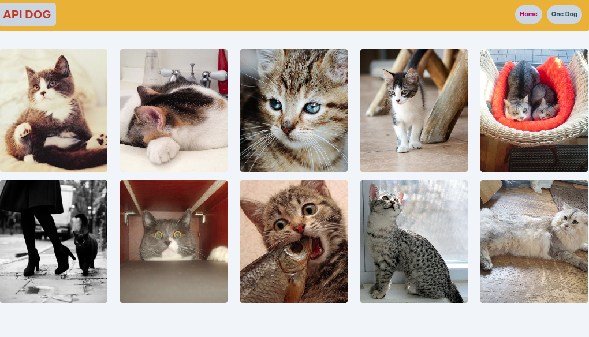
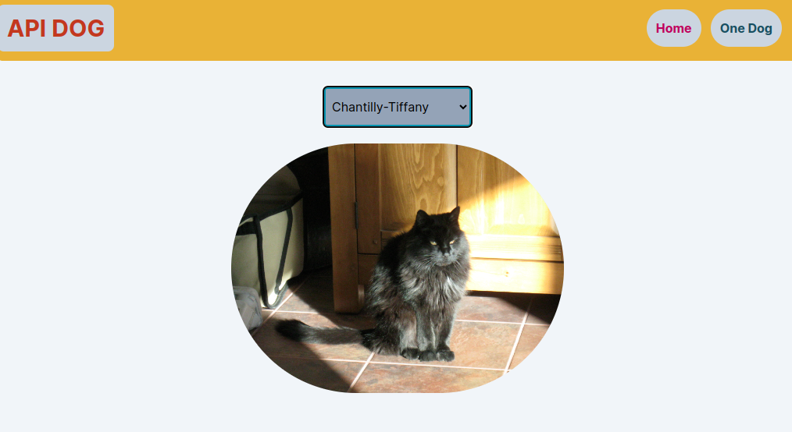
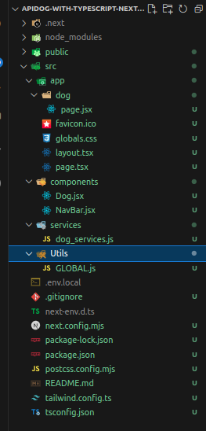

# Proyecto de API de Dog con Next.js y Tailwind CSS

Este proyecto utiliza Next.js y Tailwind CSS para crear una aplicación web que interactúa con la API de Dog (https://apidog.com/). El objetivo principal es mostrar una lista de razas de perros y permitir a los usuarios buscar imágenes de perros por raza.

## Clona el Repositorio

Ejecuta el siguiente comando para clonar el repositorio:

```
git clone https://github.com/arielZarate/apiDogWithTypescript_NextJx.git

```

- luego de decargado instala las dependencias ejecuntando `npm i`

## Imágenes del Proyecto

A continuación, se muestran dos imágenes del proyecto `apiDogWithTypescript_NextJx`:

### Pantalla Principal


_Figura 1: Pantalla Principal del Proyecto_

En esta imagen, se muestra la pantalla principal de la aplicación, donde los usuarios pueden seleccionar una raza de perro y ver una imagen correspondiente.

### Búsqueda por Raza


_Figura 2: Búsqueda por Raza del Proyecto_

En esta imagen, se muestra la funcionalidad de búsqueda por raza de perro, donde los usuarios pueden ingresar el nombre de una raza y ver imágenes relacionadas.

## Configuración del Proyecto

- Se utiliza Next.js como el framework de React.
- Tailwind CSS se emplea para estilizar la aplicación.
- Se utiliza una variable de entorno global en el archivo `.env.local` para definir los endpoints posibles:
  - `API_KEY=jaja_gUEtgXbKVS9dJkeri35S9qMJ5i4sUI7yjkFF8yzsJQdlk8bCS7wBGLv2jdYo1X6P`: Define la api_key , ud debe crear una cuenta y usar su apikey

## Utils

- utilizo esta folder para crear un archivo Global.js donde tendre todas las url posibles, importa la api key del .env

```javascript
let key = process.env.API_KEY;

export const url_images = `https://api.thecatapi.com/v1/images/search?&mime_types=jpg&format=json&limit=100&api_key=${key}`;

export const url_random = `https://api.thecatapi.com/v1/images/search`;
export const url_imagesByBreeds = `https://api.thecatapi.com/v1/images/search?&breed_ids=`;

export const url_breeds = `https://api.thecatapi.com/v1/breeds`;
```

- esta url son usadas por el service para hacer el fetch

## Estructura de Carpetas



- `components/`: Contiene los componentes reutilizables de la aplicación.
- `app/`: Contiene las páginas de la aplicación.
- `services/`: Contiene los servicios para interactuar con la API de Dog.
- `Utils/`: Contiene los url que se usaran en cada endpoint partiendo de la url base.

### Servicios

- dog_services.js
- El servicio dog_services contiene las funciones para interactuar con la API de Dog.

```javascript
import {
  url_images,
  url_random,
  url_breeds,
  url_imagesByBreeds,
} from "@/Utils/GLOBAL";

export const fetchDog = async () => {
  const res = await fetch(`${url_images}`);
  const data = await res.json();
  //console.log(data);
  return data;
};

export const fetchOneDog = async () => {
  const res = await fetch(`${url_random}`);
  const data = await res.json();
  //console.log(data);
  return data;
};

export const fetchBreeds = async () => {
  const res = await fetch(`${url_breeds}`);
  const data = await res.json();
  //console.log(data);
  return data;
};

export const fetchDogByBreed = async (name) => {
  try {
    const res = await fetch(
      `${url_imagesByBreeds}${name}&api_key=${process.env.API_KEY}`
    );
    const data = await res.json();
    //console.log(data);
    return data;
  } catch (error) {
    console.log(error.message);
  }
};
```

## Componentes

### Navbar.jsx /tsx

El componente `Navbar` muestra la barra de navegación con enlaces a las páginas principales.

```jsx
// Código de Navbar.js

import React from "react";
import Link from "next/link";
function NavBar() {
  return (
    <header className="flex bg-yellow-500 text-white rounded-md py-3  justify-between">
      <Link href="/">
        <h3 className="bg-slate-300 text-orange-700 w-30  rounded-lg text-3xl font-bold p-3">
          API DOG
        </h3>
      </Link>

      <ul className="font-bold text-slate-900 flex flex-row gap-3  justify-center  items-center mx-5">
        <Link
          href="/"
          className=" bg-slate-300 rounded-full text-pink-700 p-3 "
        >
          <li>Home</li>
        </Link>

        <Link
          href="/dog"
          className=" bg-slate-300 rounded-full p-3 text-cyan-900 "
        >
          <li>One Dog</li>
        </Link>
      </ul>
    </header>
  );
}

export default NavBar;
```

### DogList.jsx /tsx

El componente DogList muestra la lista de razas de perros.

```jsx
import React from "react";

// dog es una props
export default function Dog({ dog }) {
  console.log(dog);
  return (
    <div className=" grid grid-cols-1 gap-x-3 gap-y-5 sm:grid-cols-1 md:grid-cols-2 lg:grid-cols-3 xl:grid-cols-4 2xl:grid-cols-5   xl:gap-x-8 mt-12">
      {dog &&
        dog.map((dg) => (
          <div key={dg.id} className="group relative">
            <div className="aspect-h-1 aspect-w-1 w-full overflow-hidden rounded-md bg-gray-200 lg:aspect-none group-hover:opacity-80 lg:h-80">
              
            </div>

            <div>
              <p></p>
            </div>
          </div>
        ))}
    </div>
  );
}
```

### Dog.js

La página dog permite a los usuarios buscar perros por raza.

El componente `Dog` tiene las siguientes funcionalidades:

- **Selección de Raza de Perro**: Presenta un menú desplegable (`select`) que permite al usuario seleccionar una raza de perro de una lista.
- **Carga de Imágenes**: Cuando el usuario selecciona una raza de perro, el componente utiliza la función `fetchDogByBreed` del servicio `dog_services` para obtener una imagen de esa raza de perro desde la API.
- **Visualización de la Imagen**: Muestra la imagen de la raza de perro seleccionada en un contenedor redondeado. Si no se ha seleccionado ninguna raza de perro, se muestra un mensaje indicando al usuario que seleccione una raza de perro.

```javascript
//==========================================
"use client";
//========================================

import React, { useState, useEffect } from "react";
import {
  fetchOneDog,
  fetchBreeds,
  fetchDogByBreed,
} from "@/services/dog_services";
fetchOneDog();
function Dog() {
  const [breed, setBreed] = useState([]);
  const [dogBredd, setDogBreed] = useState({});

  ///============handleChamge===========0
  const handleChange = async (e) => {
    // console.log(e.target.value);
    //setNameSelected(e.target.value);
    let dog = await fetchDogByBreed(e.target.value);

    ///lo cargo al estado
    setDogBreed(dog[0]);
  };

  console.log("breed selected", dogBredd);

  //========================================
  useEffect(() => {
    fetchBreeds().then((r) => {
      //console.log(r);
      setBreed(r);
    });
  }, []);

  return (
    <>
      <div className="mt-8 flex flex-col items-center">
        <div className="">
          <select
            onChange={(e) => handleChange(e)}
            name="selectDog"
            id="selectDog"
            className=" bg-slate-400  w-48 rounded-md  py-3 px-1  border-4 border-cyan-600 mb-5 "
          >
            <option value="">Selecciona una raza</option>
            {breed.length > 0 &&
              breed.map((b) => (
                <>
                  <option key={b.id} value={b.id}>
                    {b.name}
                  </option>
                </>
              ))}
          </select>
        </div>

        <div className="group relative">
          <div className="aspect-h-1 aspect-w-1 w-full overflow-hidden rounded-full bg-gray-200 lg:aspect-none  lg:h-80 ">
            <div className="absolute inset-0  rounded-full bg-black opacity-0 transition-opacity group-hover:opacity-15"></div>
            {dogBredd.url ? (
              
            ) : (
              <div className="h-full w-full flex justify-center items-center text-gray-500 p-8">
                <span>Selecciona una raza de perro para ver</span>
              </div>
            )}
          </div>
        </div>
      </div>
    </>
  );
}

export default Dog;
```

### Page.tsx o Index

Esta es la pagina que se ejecuta primero aca envuelvo los demas componentes

```ts
"use client";
import { fetchDog } from "@/services/dog_services";
import Image from "next/image";
import React, { useState, useEffect } from "react";
import DogList from "@/components/Dog";

//=============================================

//===========HOME===========================
export default function Home() {
  const [dog, setDog] = useState();

  //TODO: cargamos el estado global dog con la data de fetch
  useEffect(() => {
    fetchDog()
      .then((res) => {
        //guardo los datos en el estado de dog
        setDog(res);
      })
      .catch((error) => console.log(error));
  }, []);

  //========================================================
  return (
    <main className=" m-1 ">
      <DogList dog={dog} />
    </main>
  );
}
```

## Contenido del Archivo .env.local

A continuación se muestra un ejemplo del contenido del archivo `.env.local` utilizado en el proyecto:

```plaintext
# Variables de Entorno para apiDogWithTypescript_NextJx


API_KEY=live_gUEtgXbKVS9dJ_acordate_de_generar_tu_apy_key_sUI7yjkFF8yzsJQdlk8bCS7wBGLv2jdYo1X6P


```

# Página de Referencia de la API Dog

La página de referencia oficial de la API Dog proporciona información detallada sobre cómo utilizar la API, incluyendo la documentación de los endpoints disponibles, ejemplos de uso y más.

Puedes encontrar la página de referencia de la API Dog en el siguiente enlace:

[API Dog](https://www.thedogapi.com/)

Asegúrate de visitar esta página para obtener más información sobre cómo utilizar la API Dog en tu proyecto.
